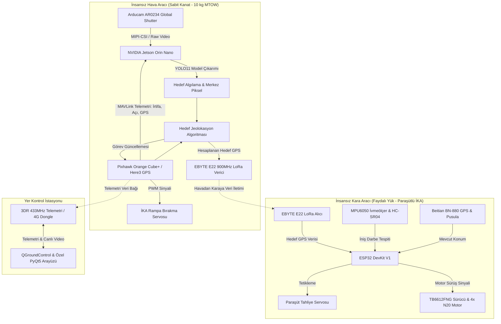

# SGM ASENA - Otonom İHA Destekli İKA ile Akıllı Hedef Tespit ve Müdahale Sistemi

[](https://www.python.org/)
[](https://github.com/ultralytics/ultralytics)
[](https://pytorch.org/)
[](https://www.nvidia.com/)
[](https://cubepilot.org/)
[](https://docs.ros.org/)
[](https://px4.io/)
[](https://opensource.org/licenses/MIT)

---

## 📌 Proje Genel Bakışı

**SGM ASENA**, zorlu ve karadan erişilmesi tehlikeli veya imkânsız coğrafyalarda (afet müdahaleleri, kimyasal sızıntı alanları, sınır güvenliği, taktik operasyonlar) **İnsansız Hava Aracı (İHA)** ve **İnsansız Kara Aracı (İKA)** iş birliğiyle sıfır insan müdahalesi gerektiren, tam otonom bir hedef tespit ve operasyon ekosistemidir.

Klasik operasyonlarda hedef tespit edildikten sonra kara ekiplerinin intikali ciddi zaman kaybına yol açmaktadır. Bu projede:
1. Sabit kanatlı İHA, **NVIDIA Jetson Orin Nano** görev bilgisayarı ve **Arducam Global Shutter** kamerasıyla hedef bölgeyi yüksek irtifadan tarar.
2. Özel olarak eğitilen **YOLO11** derin öğrenme modeli hedefi anlık olarak tespit eder.
3. OpenCV ve trigonometrik izdüşüm algoritmalarıyla hedefin **WGS84 GPS koordinatı (Enlem, Boylam)** anlık olarak havada hesaplanır.
4. Elde edilen koordinat, **900 MHz LoRa** hattı üzerinden henüz hava aracının kargo haznesinde bulunan İKA'ya aktarılır.
5. İKA kontrollü olarak paraşütle serbest bırakılır; darbe sensörleri ile iniş algılandığı anda servo mekanizması paraşütü tahliye eder ve İKA doğrudan hedefe otonom sürüş gerçekleştirir.

---

## 🏗️ Sistem Mimarisi



---

## 🧠 Yapay Zekâ & Bilgisayarlı Görü Hattı

### Model Mimarisi & Eğitimi
- **Model:** `YOLO11 Nano (yolo11n)`
- **Veri Seti:** 16.622 etiketli görüntü (`Altay Kare Tanımlama v3`).
- **Veri Artırma (Data Augmentation):** Auto-orient, 640x640 ölçekleme, %50 yatay çevirme, $\pm5^\circ$ dereceli döndürme, $\pm15\%$ parlaklık değişimi.
- **Eğitim Parametreleri:** 100 Epoch, Cosine LR Scheduler, Batch size 16/32, Çözünürlük: 640x640.

### 📊 Eğitim Başarım Metrikleri (100. Epoch)

| Metrik | Değer | Açıklama |
| :--- | :---: | :--- |
| **Precision (P)** | **%99.49** | Yanlış pozitif tespit oranı neredeyse sıfır |
| **Recall (R)** | **%99.71** | Hedef kaçırma oranı %0.29 seviyesinde |
| **mAP@50** | **%99.36** | Yüksek güven aralığında nesne tespit doğruluğu |
| **mAP@50-95** | **%89.51** | Bounding box örtüşme hassasiyetinde üstün başarım |
| **Box Loss** | `0.506` | Kutu regresyon kaybı stabil şekilde minimuma inmiştir |
| **Class Loss** | `0.187` | Hedef sınıf ayrımı hatasız yakınsamıştır |

---

## ⚡ Kenar Bilişim & Model Optimizasyonu

Jetson Orin Nano üzerinde düşük güç tüketimi ve gerçek zamanlı yüksek FPS sağlamak amacıyla model optimizasyon hattı kurulmuştur:

```bash
# Modelleri ONNX ve OpenVINO formatlarına dönüştür
python optimize.py

# CPU / Edge Gecikme ve FPS Kıyaslamasını Çalıştır
python benchmark.py
```

### Benchmark Kıyaslama Tablosu

| Model Formatı | Çözünürlük | Çıkarım Gecikmesi (ms) | FPS Değeri | Donanım Uyumluluğu |
| :--- | :---: | :---: | :---: | :--- |
| **PyTorch (FP32)** | 640x640 | ~75 - 90 ms | 11 - 13 FPS | Prototipleme & Test |
| **ONNX (Simplified)** | 640x640 | ~35 - 45 ms | 22 - 28 FPS | Gömülü Çapraz Platform |
| **OpenVINO (FP16)** | 640x640 | ~25 - 32 ms | 31 - 40 FPS | Intel / VPU / Edge CPU |
| **TensorRT (FP16/INT8)**| 640x640 | **~12 - 16 ms** | **60+ FPS** | **NVIDIA Jetson Orin Nano** |

---

## 📐 Hedef Jeolokasyon (Piksel $\rightarrow$ WGS84 GPS) Matematiği

Tespit edilen hedefin görüntü merkezinden olan sapması ($dx_{px}, dy_{px}$), İHA'nın anlık irtifası ($h_{AGL}$), kamera görüş açıları ($HFOV, VFOV$) ve İHA yönelim açıları ($\theta_{pitch}, \phi_{roll}, \psi_{yaw}$) kullanılarak dönüştürülür:

$$\alpha_x = \left(\frac{u - c_x}{c_x}\right) \cdot \frac{HFOV}{2} + \phi_{roll}, \quad \alpha_y = \left(\frac{c_y - v}{c_y}\right) \cdot \frac{VFOV}{2} + \theta_{pitch}$$

$$dx_{body} = h \cdot \tan(\alpha_x), \quad dy_{body} = h \cdot \tan(\alpha_y)$$

Dünya Kuzey-Doğu (NED) eksenine dönüşüm ve WGS84 küresel koordinat sapması:

$$\begin{bmatrix} dNorth \\ dEast \end{bmatrix} = \begin{bmatrix} \cos(\psi) & -\sin(\psi) \\ \sin(\psi) & \cos(\psi) \end{bmatrix} \begin{bmatrix} dy_{body} \\ dx_{body} \end{bmatrix}$$

$$\Delta Lat = \frac{dNorth}{R_{dunya}} \cdot \frac{180}{\pi}, \quad \Delta Lon = \frac{dEast}{R_{dunya} \cdot \cos(Lat_{IHA})} \cdot \frac{180}{\pi}$$

> Bu matematiksel modelleme `hedef_koordinat_hesaplayici.py` modülü altında doğrulanmıştır.

---

## 🛠️ Donanım & Aviyonik Özellikler

### İnsansız Hava Aracı (İHA)
- **Tür / Yapı:** Sabit Kanat, T-Kuyruk, Trapez Geometri (NACA 4412 Profil)
- **Malzeme:** 3K Twill Karbonfiber Gövde, Balsa İskelet, Karbon Boru Kirişler
- **Boyutlar:** Kanat Açıklığı: 2.495 mm | Gövde Boyu: 1.878 mm
- **Ağırlık:** Boş Ağırlık: ~8.000 g | MTOW: 10.000 g | Faydalı Yük: 2.000 g
- **İtki Sistemi:** 2x SunnySky X4125 480KV + 14x8 Ahşap Pervane (Toplam İtki: ~9.950 g)
- **Güç:** 6S 16.000 mAh 65C Li-Po, Matek PDB-HEX 12S (264A), XL4016 Ayarlanabilir Regülatör
- **Otopilot:** Pixhawk Orange Cube+ (Yedekli IMU/Baro), Here3 CAN GPS, Garmin Lidar-Lite v3
- **Görev Bilgisayarı:** NVIDIA Jetson Orin Nano Developer Kit
- **Kamera:** Arducam B0429 2.3 MP AR0234 Global Shutter (Jello efektini önler)

### İnsansız Kara Aracı (İKA - Faydalı Yük)
- **Kontrolcü:** ESP32 DevKit V1
- **Tahrik:** 4x 12V N20 Redüktörlü Mikro DC Motor + TB6612FNG Sürücü
- **Sensörler:** MPU6050 İvmeölçer/Jiro (İniş Şoku Algılama), HC-SR04 Mesafe Sensörü, Beitian BN-880 GPS/Pusula
- **Haberleşme:** EBYTE E22 900T22D 900MHz LoRa (7 km menzil)
- **Paraşüt Tahliye:** Mekanik gerdirici ve servo tetiklemeli serbest bırakma mekanizması

---

## 🌐 Simülasyon & Dijital İkiz (ROS 2 + PX4 SITL)

Fiziksel prototip üretilmeden önce sistemin aerodinamik ve yazılımsal kararlılığı simülatörde doğrulanmıştır:
- **Simülasyon Ortamı:** Gazebo 3D Fizik Simülatörü
- **Uçuş Yazılımı:** PX4 Autopilot SITL (Software-in-the-Loop)
- **Haberleşme Köprüsü:** Micro-XRCE-DDS Agent (uORB mesajları ile ROS 2 topic'leri arasında köprü)
- **Görev Takibi:** QGroundControl & Özel PyQt5 Tabanlı Yer Kontrol İstasyonu

---

## 🚀 Kurulum ve Kullanım

### 1. Gereksinimleri Yükleme
```bash
git clone https://github.com/kullanici_adiniz/IHA_YOLOv11.git
cd IHA_YOLOv11

# Sanal ortam oluşturma ve etkinleştirme
python -m venv .venv
source .venv/bin/activate  # Windows için: .venv\Scripts\activate

# Bağımlılıkları yükle
pip install -r requirements.txt
```

### 2. Modeli Eğitme
```bash
python egitim.py
```

### 3. Model Optimizasyonu ve Benchmark
```bash
python optimize.py
python benchmark.py
```

### 4. Canlı Hedef Tespiti & Test
```bash
python canli_tahmin.py
```

### 5. Koordinat Dönüşüm Testi
```bash
python hedef_koordinat_hesaplayici.py
```

---

## 👥 Ekip & Katkıda Bulunanlar

**SGM ASENA Takımı - Konya Teknik Üniversitesi**
- **Takım Sorumlusu:** Kadir YÜCEL
- **Yazılım & Yapay Zekâ Ekibi:** Model Eğitimi, Görüntü İşleme, ROS 2 & MAVLink Entegrasyonu, Arayüz Tasarımı
- **Elektrik-Elektronik Ekibi:** Aviyonik Sistemler, Güç Yönetimi, LoRa & Telemetri Haberleşmesi
- **Mekanik Ekibi:** Aerodinamik Hesaplama, Karbonfiber İmalat, Bırakma ve Paraşüt Mekanizmaları

---

## 📄 Lisans
Bu proje [MIT Lisansı](LICENSE) altında lisanslanmıştır.
